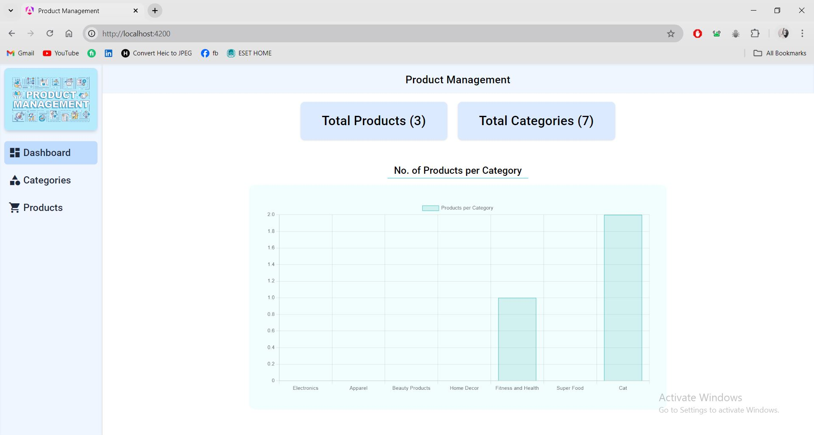
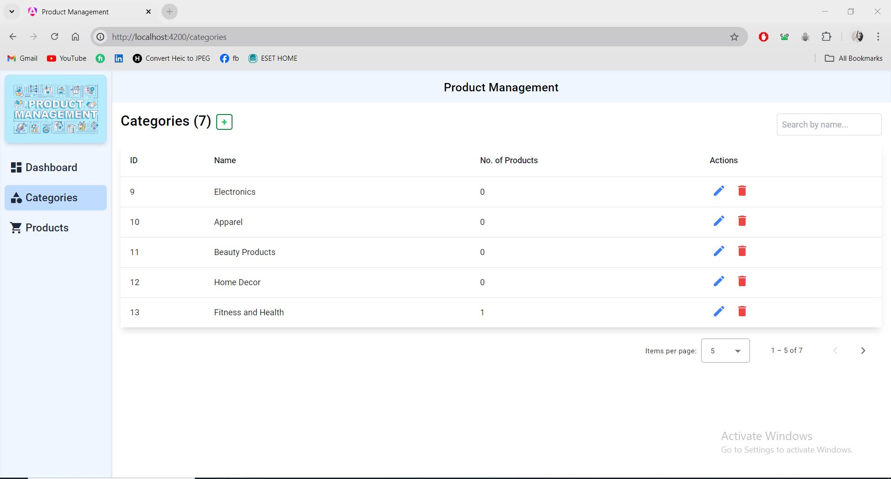
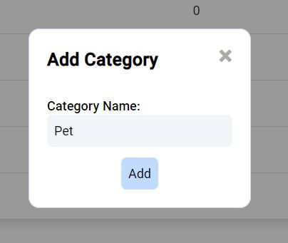
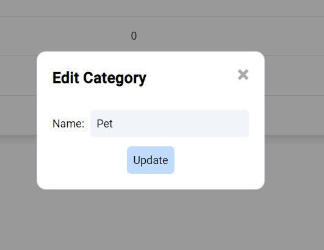
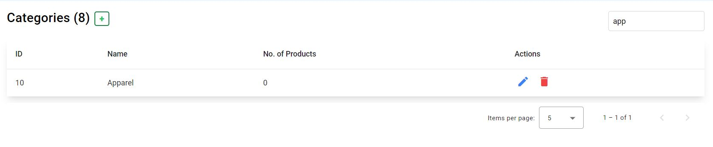
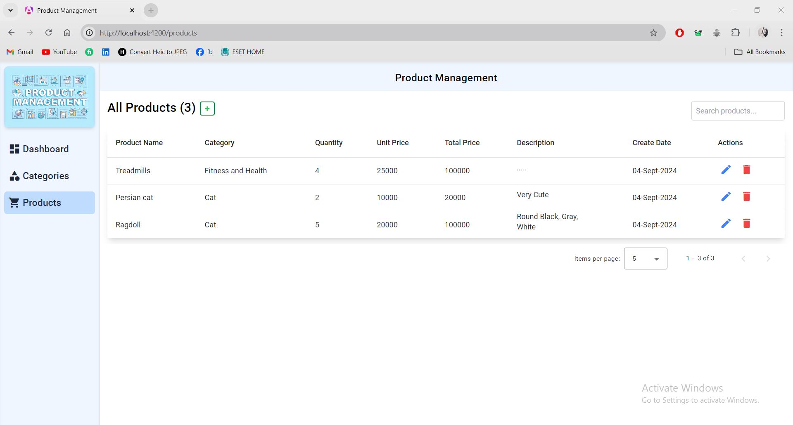
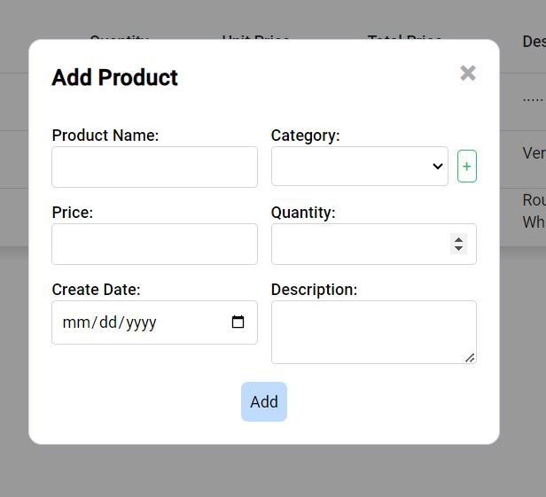
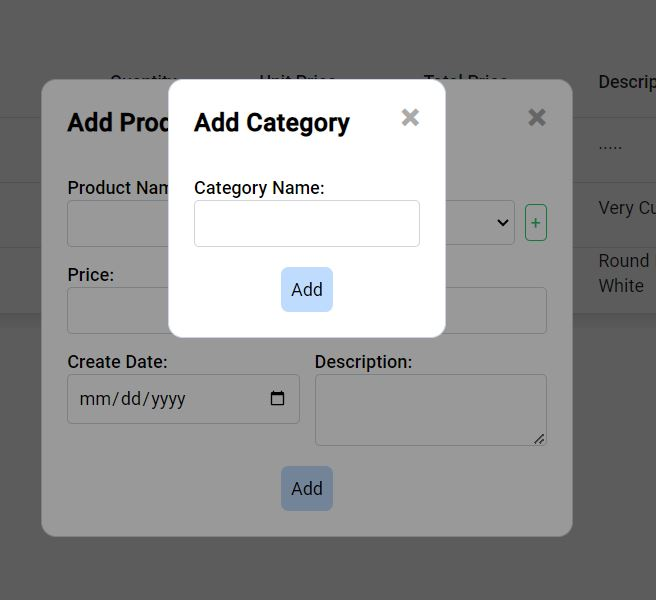
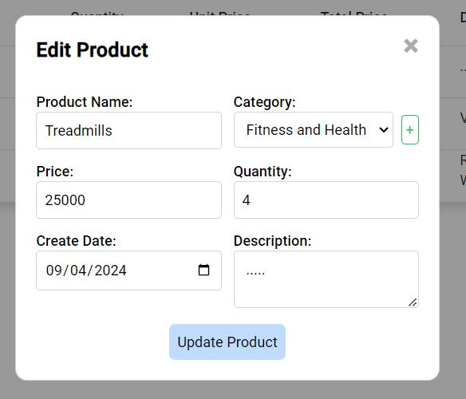
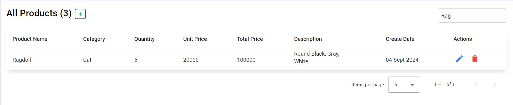

## To run the project

**Please start the server before starting the client**

- cd client
- npm i
- ng serve

## For visual representation using static images please visit

https://drive.google.com/file/d/1WaP7E-ALSJGZ20LqI8lPwqEX8mTrshZI/view?usp=sharing

## Dashboard Page

## Category Page

## Product Page

